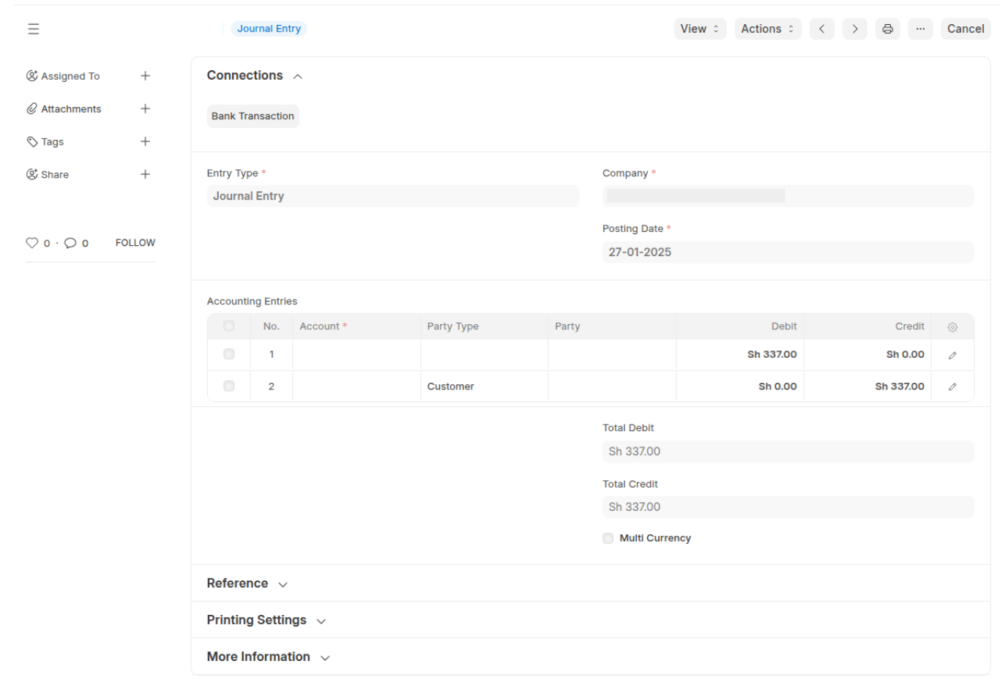

# Feature: Importing Customer ITBIS Withholding from DGII to ERPNext

## 1. Purpose

This doctype allows users to import ITBIS Withholding data directly from the Dominican Republic Revenue Authority (DGII)/iTax website into ERPNext using the built-in Data Import tool. The goal is to simplify tax reconciliation, ensure compliance, and automate financial entries.

## 2. Workflow Overview

1.  **Download ITBIS Withholding Data from iTax**
    * Users log in to the iTax portal and export their ITBIS Withholding Certificate as a Excel file.
2.  **Use ERPNext’s Data Import Tool**
    * Navigate to Data Import in ERPNext.
    * Select the ITBIS Withholding Doctype.
    * Upload the exported Excel file or attach a google sheets link to a google sheet that is publicly available.
    * Map columns to match ERPNext fields (if necessary).
    * Import the data.
3.  **ITBIS Withholding Doctype Entry**
    * Each imported record is stored as a new ITBIS Withholding document.
    * Users can review entries before submission.
4.  **Automated Journal Entry Creation (Upon Submission)**
    * When a ITBIS Withholding record is submitted:
        * A Journal Entry is automatically created.
        * The withholding amount is credited to the predefined Withholding ITBIS Payable account.
        * The corresponding customer account is debited accordingly.
        * The Journal Entry is linked to the ITBIS Withholding record for easy tracking.

## 3. Key Implementation Details

* **Company Doctype Enhancements**
    * Added default Withholding ITBIS Payable Account to ensure correct financial postings.
* **ITBIS Withholding Doctype**
    * Created a new submittable Doctype to track customer ITBIS Withholding transactions.
    * Includes fields for:
        * Customer Name
        * DGII PIN
        * Withheld Amount
        * Date of Transaction
        * Journal Entry Link
* **Custom Script for Journal Entry Automation**
    * Implemented an `on_submit` trigger to create a Journal Entry automatically.
    * Journal Entry follows the correct debit/credit mapping based on the Company’s default accounts.
    * Ensures compliance with tax reporting by maintaining accurate records.

## 4. Screenshots & UI Changes

* **Company Default ITBIS Withholding Accounts**

* **Data Import Tool Interface for ITBIS Withholding**

* **ITBIS Withholding Doctype Example**

* **Journal Entry Automation**

## 5. Benefits & Impact

* ✅ **Automates tax compliance** – Reduces manual effort in recording withheld ITBIS.
* ✅ **Improves accuracy** – Eliminates errors from manual bookkeeping.
* ✅ **Enhances traceability** – Links ITBIS Withholding records with Journal Entries.
* ✅ **Streamlines reconciliation** – Helps finance teams match iTax records with ERPNext.